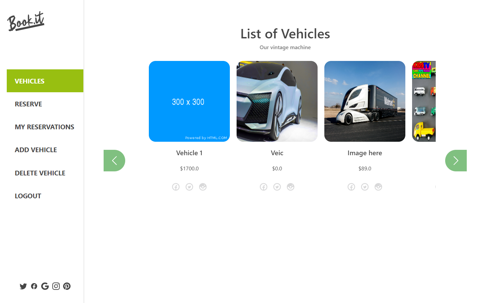

# Book.it 
> A an app to rent your dream vintage vehicle.

## Live Demo

[Live demo](https://bookit-fe.netlify.app/)

## Kanban board
[Kanban link](https://github.com/users/Danie12345/projects/4/views/1)
[Kanban screenshot](https://user-images.githubusercontent.com/35552263/190486489-5c7e34a5-5727-44b7-9e57-5fa7a435fd21.png)

## Built With

- React
- Redux
- Bootstrap React
- Crypto-js
- Axios

## Getting Started

To get a local copy follow these simple example steps.  

1.- Open the terminal window and clone the repository using this command:  
`git clone https://github.com/Danie12345/bookit-fe.git` 

2.- Change the directory to the react-bookstore directory  
`cd bookit-fe`  
3.- Install the project's dependencies by running this command:   
`npm install`  
4.- Generate the dist folder using this command:  
`npm run build`  
5.- Run this command to see the page `npm start`  
6.- To see the code open the project in the code editor of your preference.  

## Author
Group of 5 members:

👤 **Emilia Zambrano**

- GitHub: [@emiliazm](https://github.com/emiliazm)
- Twitter: [@emilia_zm](https://twitter.com/emilia_zm)
- LinkedIn: [LinkedIn](https://www.linkedin.com/in/emilia-zambrano-montero-aa30a611b/)

👤 **Daniel Malo**

- GitHub: [@Danie12345](https://github.com/Danie12345)
- Twitter: [@DanielMalo_v4](https://twitter.com/DanielMalo_v4)
- LinkedIn: [Daniel Malo](https://linkedin.com/in/daniel-malo)

👤 **Joshua Ivie**

- GitHub: [@joshuaivie](https://github.com/joshuaivie)
- Twitter: [@joshuaivie\_](https://twitter.com/joshuaivie_)
- LinkedIn: [joshuaivie](https://linkedin.com/in/joshuaivie)

👤 **Juan Luis Palacios**

- GitHub: [@JuanLPalacios](https://github.com/JuanLPalacios)
- Twitter: [@JuanLuisPalac20](https://twitter.com/twitterhandle)
- LinkedIn: [LinkedIn](https://www.linkedin.com/in/juan-luis-palacios-p%C3%A9rez-95b39a228/)

👤 **Adaobi Vivian Okoye**

- GitHub: [@githubhandle](https://github.com/adanzeakonobi) 
- Twitter: [@twitterhandle](https://twitter.com/Adaebubemmuta)
- LinkedIn: [LinkedIn](https://linkedin.com/in/okoyeaadaobi)

## 🤝 Contributing

Contributions, issues, and feature requests are welcome!

Feel free to check the [issues page](./issues)

## Show your support

Give a ⭐️ if you like this project!

## Acknowledgments

- [Murat Korkmaz](https://www.behance.net/muratk) for his design

## 📝 License

This project is [MIT](./LICENSE.md) licensed.